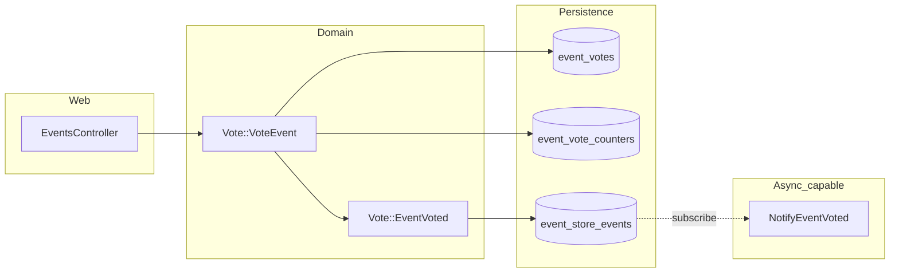

# Billetto Events

Rails application that lists upcoming events (sourced for Billetto-style discovery) and lets signed-in users **upvote** or **downvote** events. Authentication is handled by **Clerk**. Votes are persisted in PostgreSQL; successful vote changes are also recorded as **domain events** in **[Rails Event Store](https://railseventstore.org/)** for auditing and side effects (such as notifications).

---

## Stack

| Layer | Choice |
|--------|--------|
| Framework | Ruby on Rails **8.1** |
| Runtime / server | Ruby **4.0.3**, **Puma** |
| Database | **PostgreSQL** |
| Assets | **Propshaft**, **importmap**, **Turbo** / **Stimulus** |
| Auth | **Clerk** (`clerk-sdk-ruby`) |
| Pagination | **Kaminari** |
| Events | **rails_event_store** (PostgreSQL-backed) |

---

## Architecture Overview

### High-level flow

1. **Browser** loads the events index (`GET /`). Optional infinite scroll loads additional pages as Turbo Streams.
2. **Clerk** establishes session state (cookies / headers) so the app knows who is signed in.
3. **Vote actions** (`PATCH /events/:id/upvote`, `PATCH /events/:id/downvote`) run only for signed-in users. They delegate to **`Vote::VoteEvent`**, which:
   - Upserts a row in **`event_votes`** (one vote per user per event).
   - Rebuilds **`event_vote_counters`** from the vote table so the list UI stays consistent.
   - Publishes **`Vote::EventVoted`** to the global event store **inside the same DB transaction** as the vote write.
4. **Subscribers** (for example **`NotifyEventVoted`**) react to `Vote::EventVoted` (today a stub for email or owner notification).



### Important directories

| Path | Role |
|------|------|
| `app/controllers/events_controller.rb` | List events; member actions for up/down vote. |
| `app/domain/vote/vote_event.rb` | Application service: vote write + counter sync + publish `EventVoted`. |
| `app/domain/vote/event_voted.rb` | Event type definition (payload shape for subscribers). |
| `app/subscribers/notify_event_voted.rb` | Handler registered on `Vote::EventVoted` (side effects). |
| `config/initializers/event_store.rb` | `RailsEventStore::Client` and subscription wiring (`after_initialize`). |
| `db/migrate/*event_store*` | Tables used by the ActiveRecord repository for Rails Event Store. |

### Dual write: relational “read model” + append-only event log

The **source of truth for “current vote”** in the UI is **`event_votes`** plus derived **`event_vote_counters`**. The **append-only log** is **`event_store_events`** (and stream bookkeeping in **`event_store_events_in_streams`**). Publishing happens in the same transaction as the vote so you do not record “something happened” without the vote actually being stored (or the inverse).

> **Note:** `Event` also defines **`apply_vote_toggle!`**, which implements toggle-style voting and updates **`events.vote_count`**. The live HTTP path uses **`Vote::VoteEvent`** instead. Keeping both implies two mental models; converging on one approach is a sensible refactor (see [Future improvements](#future-improvements)).

---


## Scaling Considerations

### Database

- **`event_votes`**: Unique index on `(event_id, clerk_user_id)` keeps one vote per user per event; upserts stay bounded per click.
- **`event_vote_counters`**: Today, counters are **recomputed from counts** after each change. That is simple and correct at moderate scale; under very high write volume, consider **incremental counter updates** (with careful locking) or **cached aggregates** refreshed asynchronously.
- **`event_store_events`**: Append-only tables grow monotonically. Plan for **partitioning / archival**, **retention policy**, and **index health** (event type, time range queries).

### Application servers

- Default RES client behaviour runs **subscriptions in-process** after publish. Multiple Puma workers each have their own subscriber instances; **exactly-once side effects** are not guaranteed without idempotency keys or deduplication stores.
- For email or external APIs, move handling to **Solid Queue** (already in the Gemfile) or another job runner, driven by the event or an outbox row.

### Reads vs writes

- The events list uses **`includes(:event_vote_counter)`** to avoid N+1 queries on counts.
- Infinite scroll uses **Turbo Stream** append responses; ensure pagination and cache headers remain coherent if you add HTTP caching.

---

## Future Improvements

1. **Unify voting APIs** — Choose either **`Vote::VoteEvent`** or **`Event#apply_vote_toggle!`** for a single behaviour (toggle vs “set vote”), and keep **`events.vote_count`** in sync if you keep that column.
2. **Async subscribers** — Enqueue `NotifyEventVoted` work in **Active Job** so HTTP latency does not depend on email or HTTP callbacks.
3. **Idempotent notifications** — Store “notification sent for event_id + user + vote_version” to avoid duplicate emails under retries or multi-worker races.
4. **Richer event payload** — Include stable actor identifiers, request id, and correlation id for tracing across services.
5. **Projections** — Optional read models (e.g. per-event timeline, moderator dashboard) built by replaying or tailing `Vote::EventVoted`.
6. **Testing** — Request specs for vote routes; unit tests for `Vote::VoteEvent` (including no-op when vote unchanged); subscriber tests with a test event store.
7. **Gem housekeeping** — `rails_event_store` may suggest migrating to **`ruby_event_store-active_record`** naming; follow upstream guidance when upgrading.
8. **Deprecation** — `RailsEventStore::Event` is deprecated in favour of **`RubyEventStore::Event`** in newer major versions; plan a small migration when you upgrade.

---

## Local development

### Prerequisites

- Ruby 4.0.3, Bundler  
- PostgreSQL  
- Clerk project (publishable + secret keys)

### Setup

```bash
bundle install
bin/rails db:create db:migrate
```

Configure Clerk keys (for example via **Rails credentials** under `clerk: publishable_key` / `secret_key` to match `config/initializers/clerk.rb`).

```bash
bin/rails server
```

Open the root URL, sign in with Clerk, and use the vote controls on the event cards.

---

