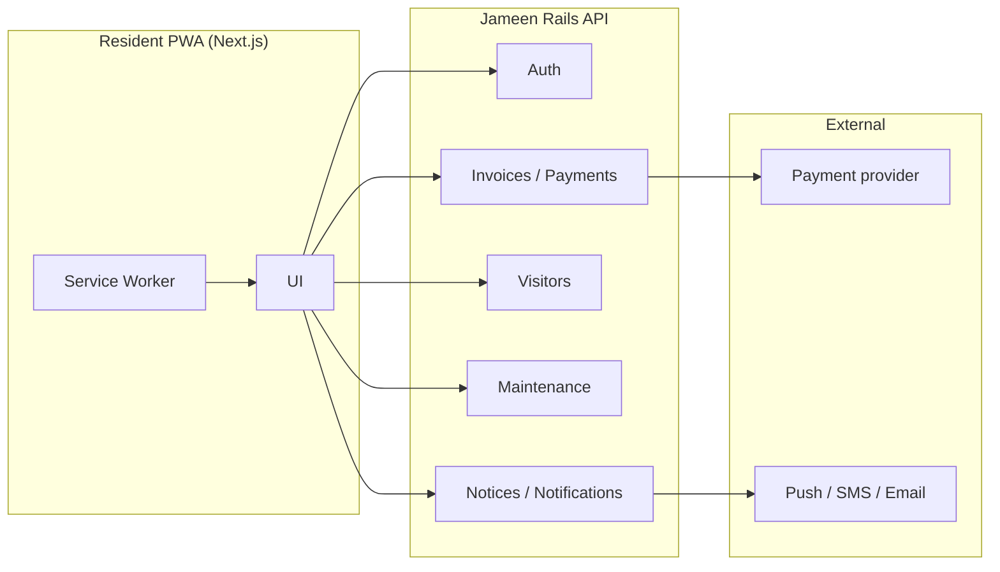
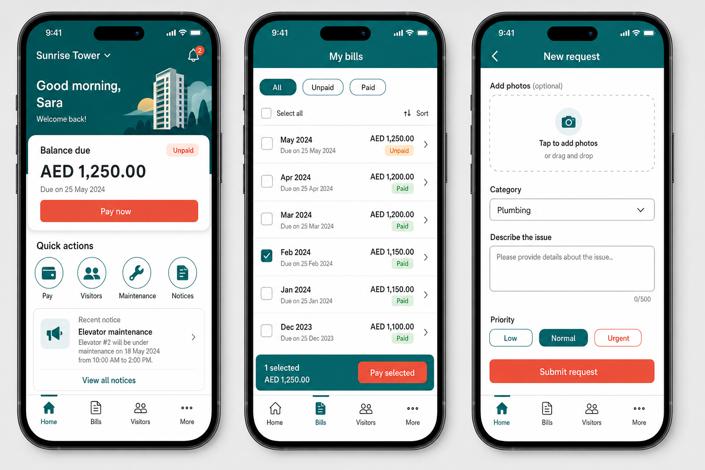
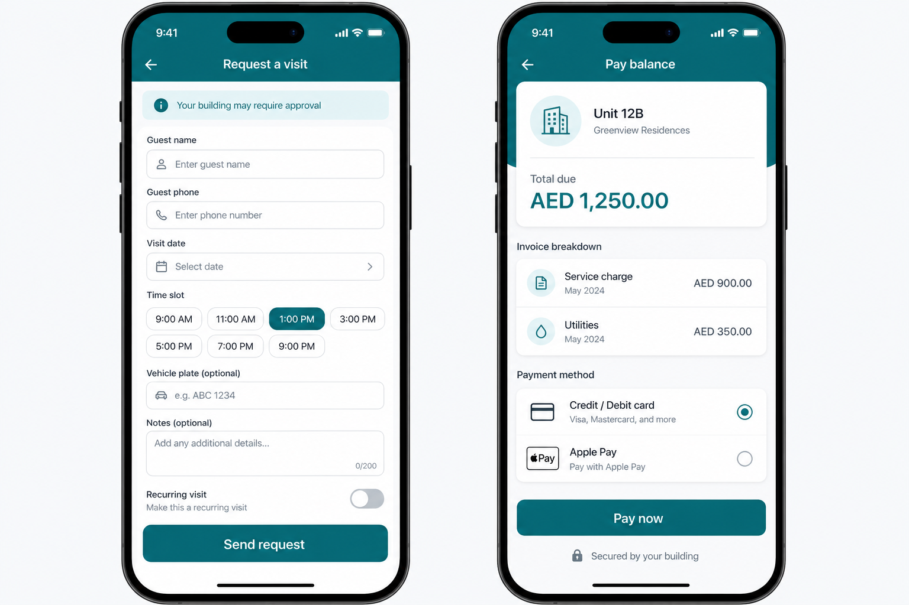

# Software Requirements Specification (SRS)

## Jameen Resident Web (Resident PWA)

| Field | Value |
|--------|--------|
| **Product** | Jameen — Resident Web |
| **Version** | 1.0 |
| **Frontend (planned)** | Next.js (App Router), mobile-first, PWA |
| **Backend** | Jameen Ruby on Rails API |
| **Related systems** | jameen-web (property staff), payment gateway, notifications |

---

## 1. Purpose and scope

### 1.1 Purpose

Define requirements for a **resident-facing** web application so residents can self-serve for **bills, payments, guest visits, maintenance requests, and notices** with minimal staff involvement, except where policy requires approval.

### 1.2 In scope

- Authenticated resident experience (per user, possibly multiple units).
- View and pay invoices; payment confirmation and receipts/history.
- Guest / visitor visit requests: create, track, cancel/edit within policy.
- Maintenance requests: create (with photos), track status, optional comments.
- Building/community notices (read).
- Profile and limited self-service settings (as allowed by API).
- **PWA:** installable app shell, offline behavior for static UI, optional web push.

### 1.3 Out of scope (initial)

- Staff administration (jameen-web).
- Native App Store / Play Store binaries (PWA “Add to Home Screen” is in scope).
- Full legal e-sign for leases (unless explicitly added when API exists).
- Third-party marketplaces beyond payments and notifications.

---

## 2. Definitions

| Term | Definition |
|------|------------|
| **Resident** | Occupant or authorized account holder for a unit |
| **Unit** | Apartment or leasable space |
| **Invoice** | Bill issued by the property (charges, fees, utilities, etc.) |
| **Visit request** | Pre-registered guest visit subject to building rules |
| **MR** | Maintenance request |
| **PWA** | Progressive Web App (manifest + service worker + installability) |

---

## 3. Stakeholders and personas

| Stakeholder | Need |
|-------------|------|
| Resident | Fast, trustworthy flows on a phone |
| Property / reception | Accurate visitor data and time windows |
| Finance | Auditable payments and reconciliation |
| Engineering | Clear API contracts, security, observability |

**Primary persona:** Resident on mobile, intermittent network, expects a clear **next action** on every screen.

---

## 4. Assumptions and dependencies

### 4.1 Assumptions

- Rails exposes a **versioned JSON API** (e.g. `/api/v1/resident/...`) with authentication agreed by Jameen (session cookies, JWT, or OAuth2/OIDC).
- Residents are authorized **per unit** on the server; the client never replaces server-side authorization.
- Payments use a **PCI-compliant** provider; PAN is not handled by Next.js servers when using hosted checkout/tokenization.

### 4.2 Dependencies

- Jameen Rails API and jameen-web operational data.
- Payment provider, email/SMS/push services.
- Object storage for uploads (e.g. S3-compatible) via signed URLs from API.

---

## 5. System context

---

## 6. Design principles (mobile-first)

1. **One primary action** per screen where possible.
2. **Thumb-friendly:** primary CTAs in the lower half on critical flows.
3. **Summaries first**, detail on drill-down.
4. **Skeleton / loading** states; avoid blocking the whole app on one request.
5. **Accessibility:** WCAG 2.1 AA targets (contrast, focus, labels, ≥44×44px touch targets).
6. **i18n / RTL-ready:** externalized strings; RTL layout when Arabic (or other RTL) is required by product.

### 6.1 Design tokens (reference)

| Token | Example value | Usage |
|--------|----------------|--------|
| Primary | `#0d7377` | CTAs, key highlights |
| Accent / urgency | `#e85d4c` | Overdue, destructive secondary emphasis |
| Surface | `#ffffff` / `#f4f6f8` | Cards, page background |
| Radius | 12–16px | Cards, modals |

---

## 7. UI mockups (mobile-first)

Screens illustrated in the images below: **home / quick actions**, **bills list**, **new maintenance**, **visitor request**, **pay invoice**.

### 7.1 Dashboard, bills, maintenance

### 7.2 Visitor request and payment

---

## 8. Functional requirements

### 8.1 Authentication (AUTH)

| ID | Requirement | Priority |
|----|-------------|----------|
| AUTH-1 | Login using Jameen-approved method (email/password, magic link, phone OTP, or SSO). | Must |
| AUTH-2 | Session survives refresh; secure token handling (prefer httpOnly cookies for refresh tokens). | Must |
| AUTH-3 | Logout clears client state and invalidates server session when API supports it. | Must |
| AUTH-4 | Expired session shows re-login with **return URL** preserved. | Must |

### 8.2 Home / dashboard (HOME)

| ID | Requirement | Priority |
|----|-------------|----------|
| HOME-1 | Unit selector when the user has access to more than one unit. | Must |
| HOME-2 | Show **total amount due** (unpaid) with link to bills / pay. | Must |
| HOME-3 | Quick actions: Pay, Visitors, Maintenance, Notices (configurable per property if API provides flags). | Should |
| HOME-4 | Short recent activity list (payments, MR/visit status changes). | Should |

### 8.3 Invoices (INV)

| ID | Requirement | Priority |
|----|-------------|----------|
| INV-1 | List invoices: status, period, amount, due date. | Must |
| INV-2 | Filters: All, Unpaid, Paid, Overdue. | Must |
| INV-3 | Invoice detail: line items, taxes, credits; PDF link if API provides. | Must |
| INV-4 | Partial payment only if business + API allow; else pay in full. | Must |

### 8.4 Payments (PAY)

| ID | Requirement | Priority |
|----|-------------|----------|
| PAY-1 | Start payment for selected invoice(s) or balance per API rules. | Must |
| PAY-2 | Support provider flows (3DS, wallets, redirects) per region. | Must |
| PAY-3 | **Idempotency:** debounce UI + server idempotency key to prevent duplicate charges. | Must |
| PAY-4 | Failure states with actionable message and retry. | Must |
| PAY-5 | Payment history with receipt links. | Should |

### 8.5 Visitor requests (VIS)

| ID | Requirement | Priority |
|----|-------------|----------|
| VIS-1 | Create: guest name, phone, visit date/time window, optional vehicle and notes. | Must |
| VIS-2 | Display status pipeline from API (e.g. Submitted → Approved/Rejected → Completed). | Must |
| VIS-3 | List upcoming and past visits. | Must |
| VIS-4 | Cancel or edit within allowed window when API permits. | Should |
| VIS-5 | Show access instructions / QR / pass code if building uses them (from API). | Could |

### 8.6 Maintenance requests (MR)

| ID | Requirement | Priority |
|----|-------------|----------|
| MR-1 | Create: category, description, priority, photos (limits per API). | Must |
| MR-2 | Track status and timestamps; show staff/resident messages if API exposes them. | Must |
| MR-3 | Validation: non-empty description; category required if API requires. | Must |
| MR-4 | Cancel if not yet in a non-cancellable state (per API). | Should |

### 8.7 Notices (NOT)

| ID | Requirement | Priority |
|----|-------------|----------|
| NOT-1 | List notices scoped to building/unit. | Should |
| NOT-2 | Detail with rich text and attachments (open or preview in browser). | Should |

### 8.8 Profile (PROF)

| ID | Requirement | Priority |
|----|-------------|----------|
| PROF-1 | Show unit, building, and read-only lease identifiers when provided. | Must |
| PROF-2 | Update only fields permitted by API (e.g. contact, notification prefs). | Should |

### 8.9 Notifications (NUDGE)

| ID | Requirement | Priority |
|----|-------------|----------|
| NUDGE-1 | Optional web push after a clear value moment (opt-in). | Should |
| NUDGE-2 | Push deep-links to invoice, MR, or visit detail. | Should |

### 8.10 PWA (PWA)

| ID | Requirement | Priority |
|----|-------------|----------|
| PWA-1 | Web manifest: `name`, `short_name`, `theme_color`, `background_color`, `display: standalone`, icons 192 and 512. | Must |
| PWA-2 | Service worker: cache app shell; **network-first** for API; graceful offline page. | Must |
| PWA-3 | Surface “Install app” / add-to-home-screen guidance (document iOS limitations). | Should |
| PWA-4 | On new SW version, prompt user to refresh. | Should |

---

## 9. Non-functional requirements

| ID | Area | Requirement |
|----|------|----------------|
| NFR-PERF | Performance | Dashboard usable on mid-tier 4G; defer non-critical requests. |
| NFR-SEC | Security | TLS only; strict CSP; no secrets in client bundle; CSRF strategy aligned with cookie auth. |
| NFR-A11Y | Accessibility | Core flows operable with keyboard and screen readers. |
| NFR-OBS | Observability | Client error reporting; support correlation with API request IDs if provided. |
| NFR-PRIV | Privacy | Minimal PII in logs; retention per policy. |

---

## 10. API expectations (for Rails team)

Publish **OpenAPI 3** (or equivalent) for:

- `POST/GET` auth, refresh, logout  
- `GET` units / memberships  
- `GET` invoices, `GET` invoice by id, optional `GET` PDF URL  
- `POST` payment session/intent, `GET` payment history  
- `CRUD` visit requests + status transitions  
- `CRUD` maintenance + **pre-signed upload** for images  
- `GET` notices  

**Errors:** JSON body with stable `code` (e.g. `FORBIDDEN`, `PAYMENT_DECLINED`, `VALIDATION_ERROR`) and human-readable `message`.

---

## 11. Security highlights

- Every unit-scoped call **must** be authorized on the server using session + unit membership.
- Upload only via **short-lived signed URLs**; enforce size/type on API.
- Rate-limit auth and payment initiation endpoints.

---

## 12. Acceptance criteria (examples)

1. **INV-1 + INV-2:** Given multiple invoices, the list supports filters and each row navigates to a detail view with correct totals.  
2. **PAY-3:** Simulated double-submit does not create duplicate successful charges (API + UI).  
3. **VIS-2:** When API returns rejection with reason, the resident sees status and reason.  
4. **PWA-2:** With network disabled after first load, the shell still renders and API-backed sections show a clear offline state.

---

## 13. Phasing

| Phase | Deliverables |
|--------|----------------|
| **MVP** | Auth, units, invoices, pay, payment history, MR create/list/detail, visit create/list/detail |
| **1.1** | Notices, push notifications, receipt archive UX |
| **1.2** | RTL/i18n hardening, recurring visits (if product), amenity modules (if any) |

---

## 14. Open questions

1. One account across **multiple buildings** — single vs multiple “contexts”?  
2. Partial payments and allocation rules?  
3. Visitor SLA and resident notifications when approval is delayed?  
4. Emergency maintenance path (24/7 hotline vs in-app)?  
5. Regional payment methods and mandatory fields?

---

## 15. Document history

| Version | Date | Notes |
|---------|------|--------|
| 1.0 | 2026-05-13 | Initial SRS + mockups in `resident-pwa/assets` |
